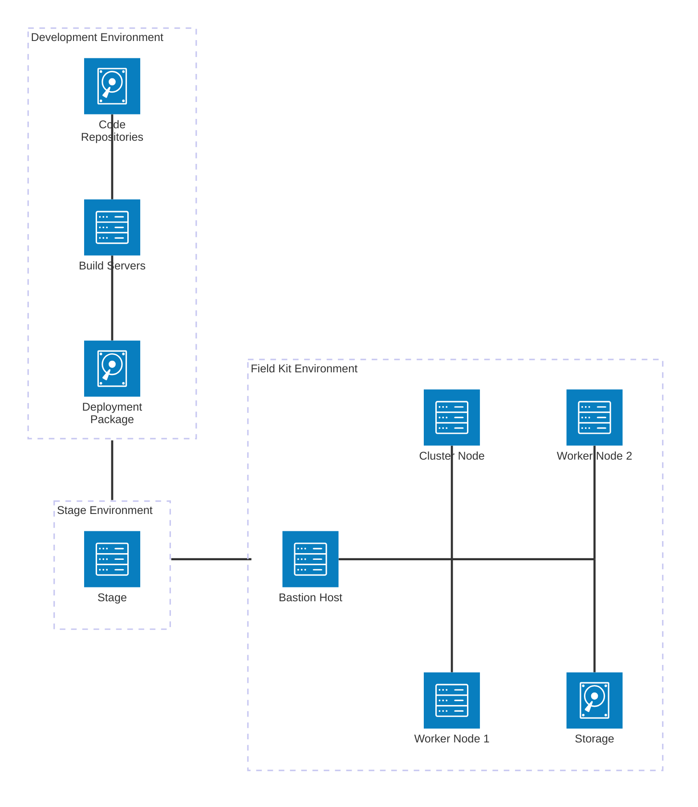

# About Field-Kit Solution Architecture

## Field Kit Architecture

This Architecture Overview diagram outlines an air-gapped deployment strategy:

* **Development Environment**  
  The software solution is built and compressed into a "deployment package"
* **Stage Environment**  
The deployment package is securely transferred from development to a staging area.  (The stage could be ISOs copied to media.)
* **Field Kit Environment**  
The field kit consists of a bastion host that will be prepared to deploy the solution from the package.   (The bastion host is most likely a laptop).   The kit consists of multiple servers and storage.

## Field Kit Architecture Diagram

