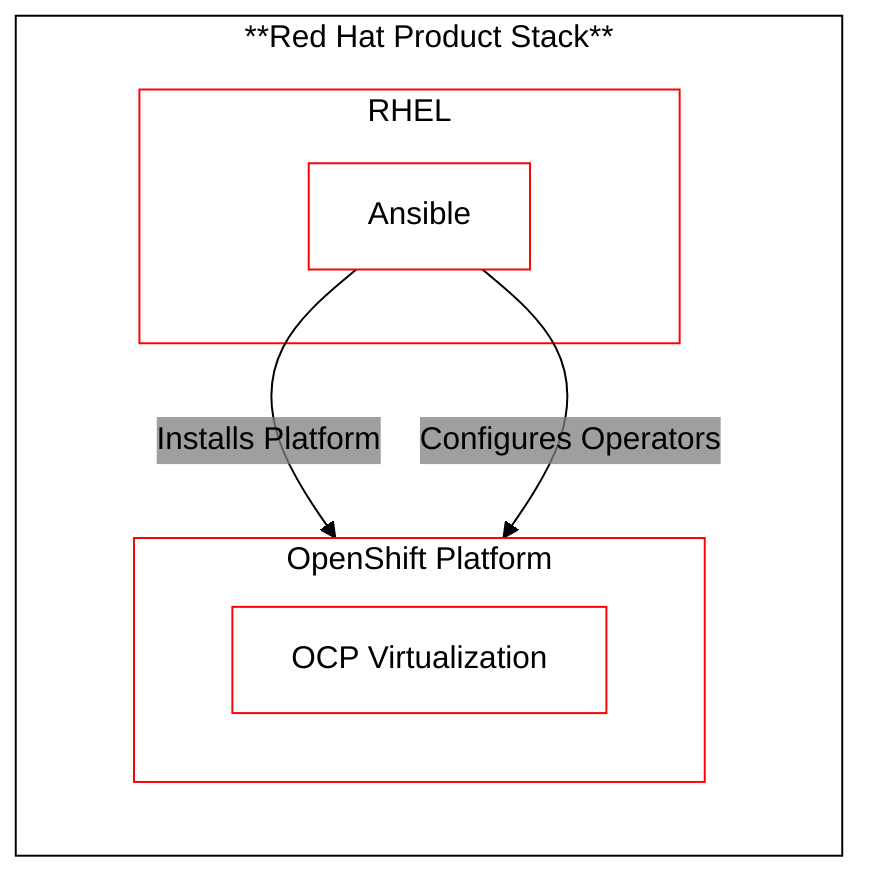

# About Field-Kit Solution 

## Which Products are in the Field Kit Solution Stack?

The *Field-Kit* technology stack contains the following **Red Hat** products:

1. Red Hat Enterprise Linux (RHEL)
2. Ansible
3. OpenShift Container Platform (OCP)
4. OpenShift Virtualization (OCP-Virt)

## Field Kit Solution Architecture

