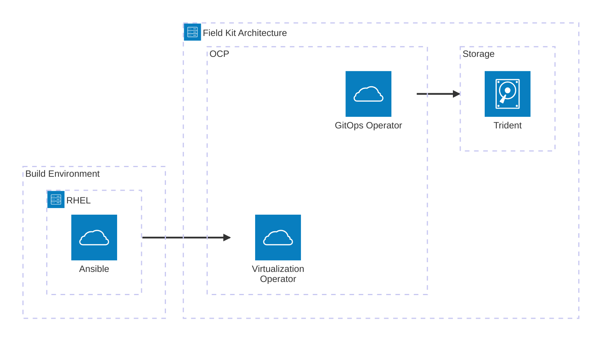

# Architecture build and run-time

```mermaid
architecture-beta

    group build[Build Environment] 
    group rhel(server)[RHEL] in build
    service ansible(cloud)[Ansible] in rhel

    group fieldkit(server)[Field Kit Architecture] 
    group ocp[OCP] in fieldkit
    group storage[Storage] in fieldkit
    service trident(disk)[Trident] in storage
    service virt(cloud)[Virtualization Operator] in ocp
    service gitops(cloud)[GitOps Operator] in ocp

    ansible{group}:R --> L:virt{group}
    gitops{group}:R --> L:trident{group}
```
