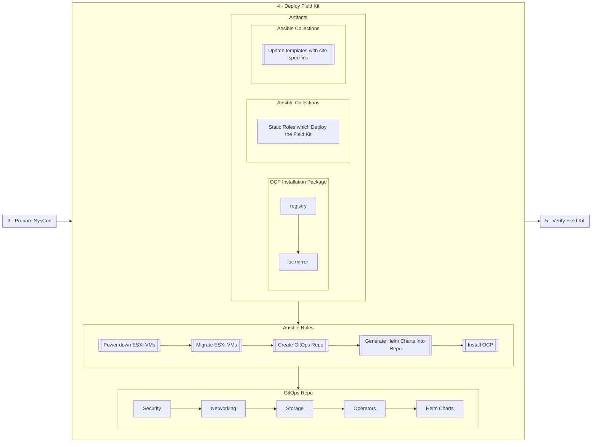

# 4 - Deploy Field Kit

```mermaid
flowchart LR
    subgraph 3[3 - Prepare SysCon]
    end
    subgraph 4[4 - Deploy Field Kit]
        subgraph Artifacts[Artifacts]
          subgraph OCP[OCP Installation Package]
            OCP1[registry]
            OCP2[oc mirror]
          end
          subgraph Collections[Ansible Collections]
            Collections1[Static Roles which Deploy the Field Kit]
          end
          subgraph Config[Ansible Collections]
            Config1[[Update templates with site specifics]]
          end
        end
        subgraph Ansible[Ansible Roles]
          Ansible1[[Power down ESXi-VMs]]
          Ansible2[[Migrate ESXi-VMs]]
          Ansible3[[Create GitOps Repo]]
          Ansible4[[Generate Helm Charts into Repo]]
          Ansible5[[Install OCP]]
        end
        subgraph GitOps[GitOps Repo]
          GitOps1[Security]
          GitOps2[Networking]
          GitOps3[Storage]
          GitOps4[Operators]
          GitOps5[Helm Charts]
        end
    end
    subgraph 5[5 - Verify Field Kit]
    end
    Artifacts --> Ansible --> GitOps
    Ansible1 --> Ansible2 --> Ansible3 --> Ansible4 --> Ansible5
    GitOps1 --> GitOps2 --> GitOps3 --> GitOps4 --> GitOps5
    OCP1 --> OCP2
    3 --> 4 --> 5
```
