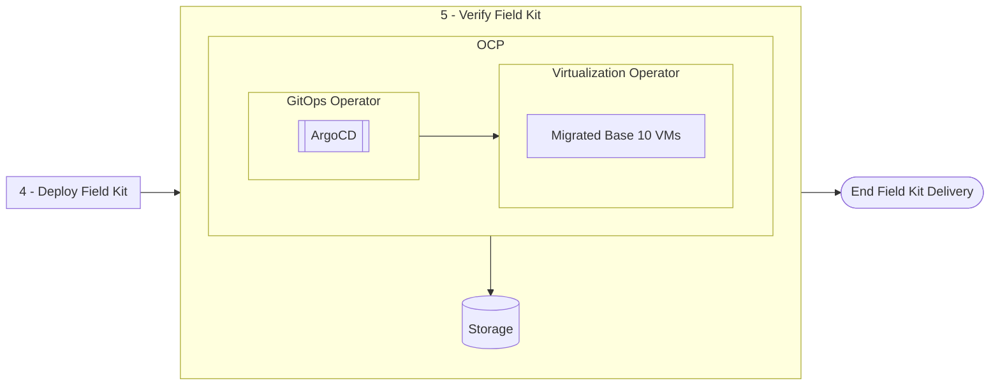

# 5 - Verify Field Kit

```mermaid
flowchart LR
    subgraph 4[4 - Deploy Field Kit]
    end
    subgraph 5[5 - Verify Field Kit]
      subgraph Platform[OCP]
        subgraph OCPVirt[Virtualization Operator]
          OCPVirt1[Migrated Base 10 VMs]
        end
        subgraph OCPGitOps[GitOps Operator]
          OCPGitOps1[[ArgoCD]]
        end
      end
      Storage[(Storage)]
    end
    Foot([End Field Kit Delivery])
    Platform --> Storage
    OCPGitOps --> OCPVirt
    4 --> 5 --> Foot
```
