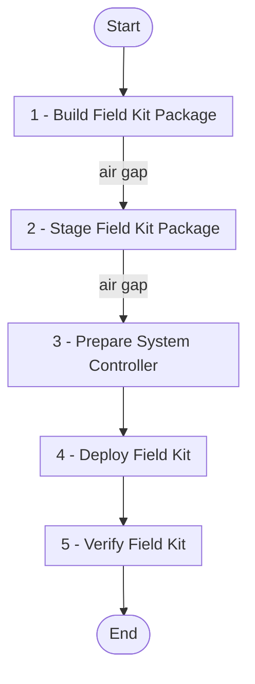

# Overview Field Kit Delivery Flow

```mermaid
flowchart TB
    Title([Start])
        subgraph Build[1 - Build Field Kit Package]
        end
        subgraph Deliver[2 - Stage Field Kit Package]
        end
        subgraph Prep[3 - Prepare System Controller]
        end
        subgraph Deploy[4 - Deploy Field Kit]
        end
        subgraph FieldKit[5 - Verify Field Kit]
        end
  Foot([End])
        Title --> Build -- air gap --> Deliver -- air gap --> Prep --> Deploy --> FieldKit --> Foot
```
