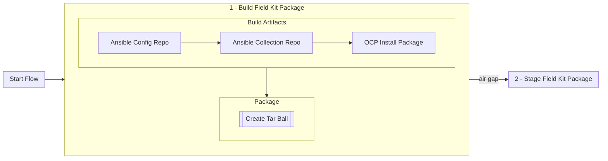

# 1 - Build Field Kit Package

```mermaid
flowchart LR
    subgraph Start[Start Flow]
    end
    subgraph 1[1 - Build Field Kit Package]
        subgraph Build[Build Artifacts]
          Build1[Ansible Config Repo]
          Build2[Ansible Collection Repo]
          Build3[OCP Install Package]
        end
        subgraph Package[Package]
          Package1[[Create Tar Ball]]
        end
    end
    subgraph 2[2 - Stage Field Kit Package]
    end
    Build --> Package
    Build1 --> Build2 --> Build3
    Start --> 1 -- air gap --> 2
```
