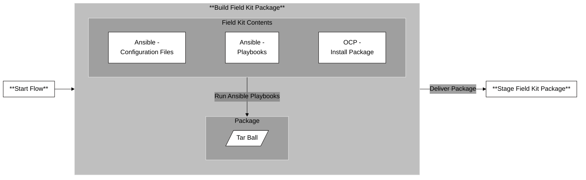

# Build Field Kit Package

## Summary

1. **Gather Components**: The Field Kit creation process starts with gathering three key components from their respective Git repositories: Ansible configuration files, Ansible playbooks, and an OpenShift Container Platform (OCP) install package.

* The Ansible playbooks, consist of roles and collections, are used by the field operator at deployment time.
* The Ansible Configuration Files, Ansible group variables, are customized with site-specific information by the field operator during preparation of deployment.
* The OCP Install Package consists of artifacts needed for a disconnected OCP installation.  For example, Operator Images, Tools (eg: Helm, Container Registry), base images for containers, storage drivers, VDDK for VMWare migration, Base images for containers, storage driver

2. **Run Playbooks**: Don't confuse this with the Ansible delivered in the package; Ansible plays are used here during build time to clone and organize components to create the package.

3. **Package**: The result of running the playbooks is the creation of a "Tar Ball", which serves as the final, compressed package.  (A tar ball, colloquially known as a tarball, is a compressed archive file on Unix-like systems, used to combine multiple files and directories into a single file for easy storage and transfer.)

4. **Deliver**: This Tar Ball is then passed to the next stage, which is the Staging Field Kit Package phase.
