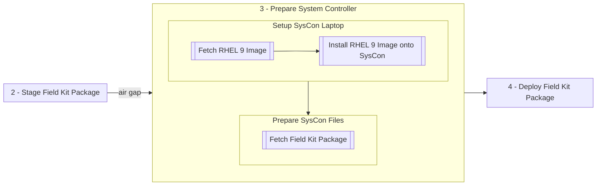

# 3 - Prepare Deployment Environment

```mermaid
flowchart LR
    subgraph 2[2 - Stage Field Kit Package]
    end
    subgraph 3[3 - Prepare System Controller]
        subgraph SysCon[Setup SysCon Laptop]
          SysCon1[[Fetch RHEL 9 Image]]
          SysCon2[[Install RHEL 9 Image onto SysCon]]
        end
        subgraph Files[Prepare SysCon Files]
          Files1[[Fetch Field Kit Package]]
        end
    end
    subgraph 4[4 - Deploy Field Kit Package]
    end
    SysCon --> Files
    SysCon1 -->SysCon2
    2 -- air gap --> 3 --> 4
```
