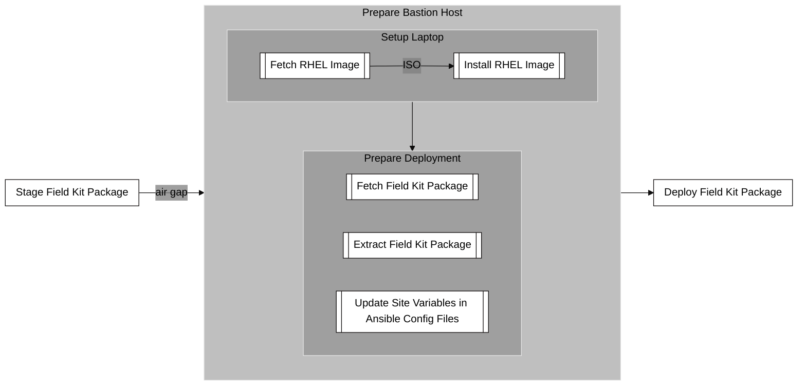

# Prepare Deployment Environment

## Summary

This flowchart details the steps involved in preparing a Bastion Host for deploying the Field Kit Package, which is the process that occurs after the air gap.  Also, *necessary manual steps for preparing VMware on the existing Field Kit, such as shutting down and exporting the VMs as well as shutting down ESXi, are documented in a separate preparation manual.*

The diagram breaks down the Prepare Bastion Host phase into two main sub-processes:

1. **Bastion Setup**  The first step is to set up a dedicated laptop. This involves fetching a RHEL (Red Hat Enterprise Linux) image, which is a type of Linux operating system, and then installing it onto the laptop from an ISO file.

2. **Deployment Preparation:** Once the bastion host is ready, the Field Kit Package is prepared.  This involves fetching the Field Kit Package, extracting its contents, and then modifying the Ansible configuration files with specific information for the deployment site. This final step is crucial for customizing the installation to the target environment.

The prepared bastion host is then ready to proceed to the next stage, which is the Deploy Field Kit Package phase. The entire process follows the air gap from the previous stage, reinforcing the isolated and secure nature of this part of the workflow
