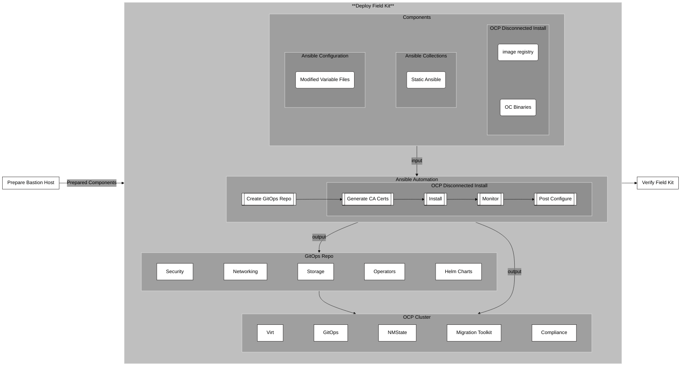

# 4 - Deploy Field Kit

## Summary

This diagram provides a detailed breakdown of the Deploy Field Kit phase, which is step four in the overall workflow. It outlines the components used for deployment, the automation process, and the final outcomes.

The deployment process begins with three **components** that were produced from the prepare bastion step:

1. **OCP Disconnected Install:** This consists of the necessary binaries and an image registry to perform an offline installation of OpenShift.

2. **Ansible Configuration:** This includes the modified variable files from the previous step, which contain site-specific information.

3. **Ansible Collections:** A static set of Ansible roles and collections used for the automation tasks.

These components are used as input for the **Ansible Automation process**. This automation begins by creating a GitOps repository, followed by a series of steps to install OpenShift in a disconnected environment: generating certificates, performing the installation, monitoring the progress, and post-configuration.  

The automation process produces two main outputs:

1. **GitOps Repository**: The deployment creates a GitOps repository that contains configurations for various cluster functions like security, networking, storage, operators, and Helm charts.  *(Note: the modified variable files are consumed by the ansible playbooks to produce site specific configuration files such as helm charts and stored in the repository.)*

2. **OCP Cluster**: The automation also installs and configures several operators on the OpenShift cluster, including Virtualization, GitOps, NMState, Migration Toolkit, and Compliance.

Finally, after the deployment is complete, the process moves to the Verify Field Kit stage.
