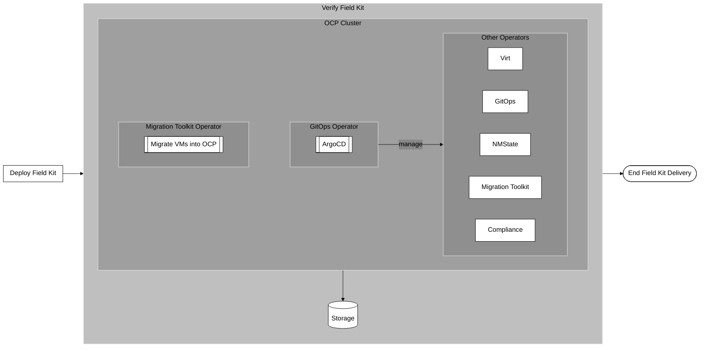

# 5 - Verify Field Kit

## Summary

This flowchart outlines the final phase of the workflow, Verifying the Field Kit, which confirms the successful deployment and functionality of the system before the process ends.

The verification process centers on three key areas:

1. **Migration Toolkit Operator** This operator is verified by confirming its ability to successfully migrate virtual machines (VMs) into the OpenShift cluster.  *(Note:  as part of the pre-requisites outside of this workflow, VMs were exported from ESXi and stored on disk.)

2. *GitOps Operator:* This is verified by checking the functionality of ArgoCD, a tool managed by the GitOps operator, which is used for continuous deployment and management of applications and configurations.  *(Note: as part of the ansible automation deployment, helm charts were generated using site specific variables.)

3. *Other Operators:* The diagram shows that the Migration Toolkit and GitOps operators manage the verification of other installed operators, including Virt, NMState, and Compliance, among others. This implies that the proper functioning of the key operators is a proxy for the health of the others.

Once all these checks are complete, the entire Field Kit delivery process is considered finished.

