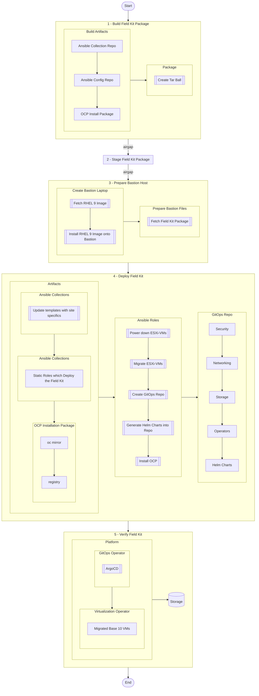

# Data Dump

Experiment with all in one diagram.
TODO: Either go with this approach of all-in-one diagram or the individual diagrams.
  

```mermaid
flowchart TB
    Title([Start])
    subgraph 1[1 - Build Field Kit Package]
        subgraph Build[Build Artifacts]
          Build1[Ansible Collection Repo]
          Build2[Ansible Config Repo]
          Build3[OCP Install Package]
        end
        subgraph Package[Package]
          Package1[[Create Tar Ball]]
        end
        Build1 --> Build2 --> Build3
        Build --> Package
    end
    subgraph 2[2 - Stage Field Kit Package]
    end
    subgraph 3[3 - Prepare Bastion Host]
        subgraph Bastion[Create Bastion Laptop]
          Bastion1[[Fetch RHEL 9 Image]]
          Bastion2[[Install RHEL 9 Image onto Bastion]]
        end
        subgraph Files[Prepare Bastion Files]
          Files1[[Fetch Field Kit Package]]
        end
        Bastion1 --> Bastion2
        Bastion --> Files
    end
    subgraph 4[4 - Deploy Field Kit]
        subgraph Artifacts[Artifacts]
          subgraph OCP[OCP Installation Package]
            OCP1[oc mirror]
            OCP2[registry]
          end
          subgraph Collections[Ansible Collections]
            Collections1[Static Roles which Deploy the Field Kit]
          end
          subgraph Config[Ansible Collections]
            Config1[[Update templates with site specifics]]
          end
        end
        subgraph Ansible[Ansible Roles]
          Ansible1[[Power down ESXi-VMs]]
          Ansible2[[Migrate ESXi-VMs]]
          Ansible3[[Create GitOps Repo]]
          Ansible4[[Generate Helm Charts into Repo]]
          Ansible5[[Install OCP]]
        end
        subgraph GitOps[GitOps Repo]
          GitOps1[Security]
          GitOps2[Networking]
          GitOps3[Storage]
          GitOps4[Operators]
          GitOps5[Helm Charts]
        end
        Config --> Collections --> OCP
        OCP1 --> OCP2
        Artifacts --> Ansible --> GitOps
        Ansible1 --> Ansible2 --> Ansible3 --> Ansible4 --> Ansible5
        GitOps1 --> GitOps2 --> GitOps3 --> GitOps4 --> GitOps5
    end
    subgraph 5[5 - Verify Field Kit]
      subgraph Platform[Platform]
        subgraph OCPVirt[Virtualization Operator]
          OCPVirt1[Migrated Base 10 VMs]
        end
        subgraph OCPGitOps[GitOps Operator]
          OCPGitOps1[[ArgoCD]]
        end
        OCPGitOps --> OCPVirt
      end
      Storage[(Storage)]
      Platform --> Storage
    end
    Foot([End])
    Title --> 1 -- airgap --> 2 -- airgap --> 3 --> 4 --> 5 --> Foot
```

