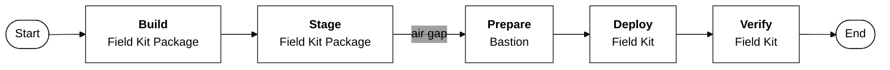

# Overview Field Kit Delivery Flow

## Summary

The diagram visualizes a sequential workflow with five key steps:

1. **Build Field Kit Package:** This initial step involves compiling and creating the field kit.

2. **Stage Field Kit Package:** Once built, the package is prepared for its transfer.

3. **Prepare Bastion:** This is a critical step that occurs after an air gap. A bastion is a fortified server that acts as a secure gateway, and in this context, it's being prepared to receive the field kit.  

4. **Deploy Field Kit:** The package is then installed or executed on the prepared bastion.

5. **Verify Field Kit:** The final step ensures the deployment was successful and the field kit is operating as intended.

### Notes

> *The air gap is a crucial element of the process, highlighting a security measure where data or systems are physically isolated from a network. This ensures that the field kit is transferred securely and is not exposed to potential threats during its delivery.*
> *Necessary manual steps for preparing VMware on the existing Field Kit, such as shutting down and exporting the VMs as well as shutting down ESXi, are documented in a separate preparation manual.*
